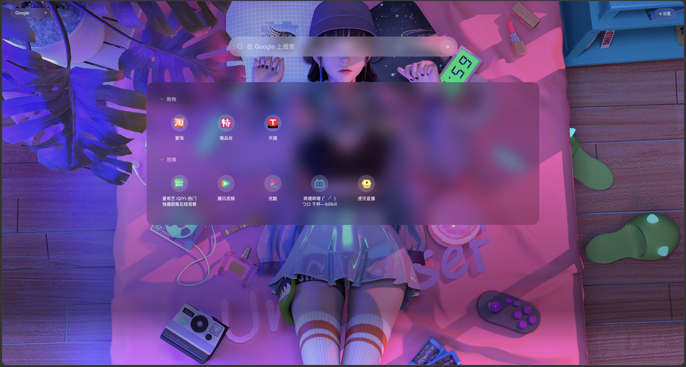
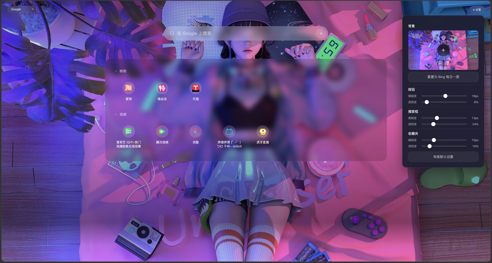

# FavorTab

🎨 极简新标签页扩展 — 完美替代浏览器默认新标签页

## 特性

| 功能 | 说明 |
|------|------|
| 🖼 **Bing 每日壁纸** | 自动获取 Bing 高清每日一图，渐入动画 + 版权信息；支持自定义上传本地图片，可随时重置回 Bing |
| 🔍 **多引擎搜索** | 内置 Google、百度、Bing、搜狗、360搜索、DuckDuckGo 六大引擎，左上角下拉切换，回车即搜 |
| 📁 **收藏夹卡片网格** | 智能读取 Chrome/Edge 书签，按文件夹层级展示为精美大卡片 |
| 🗂 **文件夹折叠/展开** | 点击文件夹名称即可折叠展开，状态自动持久化 |
| ✏️ **文件夹重命名** | 点击编辑图标就地重命名，Enter 保存 / Escape 取消 |
| ❌ **书签删除** | 鼠标悬停显示删除按钮，确认后直接从浏览器书签中移除 |
| 🖌 **毛玻璃效果自定义** | 设置面板独立调节按钮区、搜索框、收藏夹的模糊度与透明度，CSS 变量实时生效 |
| ⚡ **离线/秒开体验** | Bing 壁纸自动缓存到 localStorage，自定义背景持久化，零网络等待 |
| 🌐 **Favicon 智能加载** | Cravatar CDN 获取网站图标，Canvas 转 base64 缓存，重启秒出 |
| 🔢 **点击计数** | 自动统计每个书签的点击次数 |

## 截图

| 主界面 | 收藏夹与设置 |
|:---:|:---:|
|  |  |

## 安装

### Chrome / Edge 网上应用店

从 Chrome 网上应用店或 Edge 加载项商店搜索 "FavorTab" 安装。

### 开发者模式（手动加载）

1. 克隆仓库
   ```bash
   git clone https://github.com/ca0t/FavorTab.git
   ```
2. 打开 Chrome/Edge，进入 `chrome://extensions`（或 `edge://extensions`）
3. 开启右上角 **开发者模式**
4. 点击 **加载已解压的扩展程序**，选择项目目录

## 技术栈

- Manifest V3
- 原生 JavaScript（零依赖）
- CSS 自定义属性（毛玻璃效果）
- Chrome Bookmarks API
- Bing Wallpaper API
- Cravatar Favicon CDN
- 国际化支持（中文 / English）

## 隐私

所有数据仅保存在本地浏览器中，无服务器、无跟踪、无隐私泄露风险。
